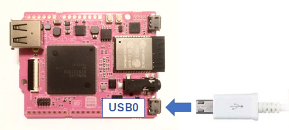
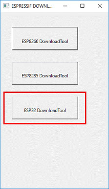
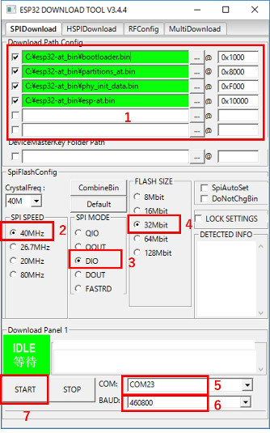

# GR-Boards_FaceDetection_WebCam
GR-PEACH、および、GR-LYCHEEで動作するサンプルプログラムです。  
GR-LYCHEEの開発環境については、[GR-LYCHEE用オフライン開発環境の手順](https://developer.mbed.org/users/dkato/notebook/offline-development-lychee-langja/)を参照ください。


## 概要
OpenCVを使った顔検出サンプルです。検出結果をWebブラウザ上に表示します。  
「xml\lbpcascade_frontalface.xml」をSDカード(もしくはUSBメモリ)に保存しておきます。このファイルは顔検出に必要なモデルファイルです。  

## [GR-LYCHEEを使う際の事前準備] ESP32ファームウェアの書き換え
本サンプルプログラムをGR-LYCHEEで使用する際はESP32をATコマンド用のファームウェアに書き換える必要があります。  
ここでは、``GR-LYCHEE_ESP32_Serial_Bridge``と``Windows PC版 Flash Download Tools V3.4.4``を使った書き込み方法を紹介します。  

まずはプロジェクト内`docs\esp32-at_bin.zip`を展開し、``GR-LYCHEE_ESP32_Serial_Bridge.bin``をGR-LYCHEEに書き込んでください。  

### シリアルドライバ
``GR-LYCHEE_ESP32_Serial_Bridge``はGR-LYCHEEのUSB0ポートをPCと接続して使用します。  

  

Windows10以外ご使用の場合、ドライバのインストールが必要となります。下記サイトの「Driver required on Windows!」からドライバーをダウンロードできます。  

https://developer.mbed.org/handbook/USBSerial

但し、「署名なしドライバ」となっていますので、お使いのWindowsバージョンによってはそのままインストールすることはできません。お使いのPC毎に設定方法が異なるため、検索サイトで「署名なしドライバ」で検索してください。  


### ESP32のFlash書き込み
Flash Download Toolsを下記からダウンロードしてください。  

Espressif’s official Flash Download Tools:  
http://espressif.com/en/support/download/other-tools?keys=&field_type_tid%5B%5D=13

`flash_download_tools_v3.4.4.zip`を展開し、`ESPFlashDownloadTool_v3.4.4.exe`を実行します。  

  
*ESP32 DownloadTool* を選択します。  

  

1. `docs\esp32-at_bin.zip`内の書き込み用の.binファイルを設定します。  
  bootloader.bin(0x1000)、partitions_at.bin(0x8000)、phy_init_data.bin(0xF000)、esp-at.bin(0x10000)を設定してください。左のチェックボックスにも忘れずにチェックを入れてください。  

2. SPI SPEEDに*40MHz*を設定します。  

3. SPI MODEに*DIO*を設定します。  

4. FLASH SIZEに*32Mbit*を設定します。  

5. COMにUSB0に割り当たったCOMポートを設定します。  

6. ボーレートを選択します。460800bpsでの書き込みを確認できていますが、書き込みに失敗するようでしたらボーレートを下げてください。

7. ESP32を書き込みモードにするため、GR-LYCHEEの **US1(IO0)** を押しながら **US0(EN)** を短押し、その後 **US1(IO0)** を離します。ターミナルソフトソフトで該当のCOMポートを開いている場合は、ターミナルソフトを終了させ、COMポートを開放してください。最後にツールのSTARTボタンを押すと書き込みを開始します。  
  


## 使い方
1. GR-Boardに電源を入れ、Terminalソフトを立ち上げます。  
  PCとの接続は mbed I/F側を使用(USB0じゃない方)を使用してください。

2. GR-Boardのリセットボタンを押すと、Terminal上にIPアドレスが出力されます。  
  Terminaｌの使い方は以下のリンクを参照下さい。  
  mbedでのボーレートのデフォルト値は9600で、このサンプルでもボーレート9600を使います。  
  https://developer.mbed.org/teams/Renesas/wiki/GR-PEACH-Getting-Started#install-the-usb-serial-communication  
  https://developer.mbed.org/handbook/SerialPC  

  ```
  GR-Boards_FaceRec_WebCam
  Finding a storage...done
  Initializing the face detector...done

  Connecting...
  MAC Address is xx:xx:xx:xx:xx:xx
  IP Address is 192.168.4.1
  NetMask is 255.255.255.0
  Gateway Address is 192.168.4.1
  Network Setup OK
  ```

3. デフォルトの接続方法は ``ESP32 AP``(GR-LYCHEE用) になっています。  
  GR-LYCHEEがアクセスポイントとなるので、PCやスマートフォン等からWiFi接続してください。  
  SSID： ``ESP32-lychee`` パスワード： ``1234567890``  

4. PCのWebブラウザで Terminalに表示された **IP Address** (上記例では 192.168.4.1)を開くと、カメラ画面が表示されます。  
  "Wait time"のスライダーバーでCamera画像の更新タイミングが変更できます。(初期値は500msです)  
  顔検出位置は青色の四角で表示されます。  


### カメラとLCDの設定
``mbed_app.json``ファイルを変更することでLCD表示をONにできます。
```json
{
    "config": {
        "camera":{
            "help": "0:disable 1:enable",
            "value": "1"
        },
        "lcd":{
            "help": "0:disable 1:enable",
            "value": "1"
        }
    }
}
```

カメラとLCDの指定を行う場合は``mbed_app.json``に``camera-type``と``lcd-type``を追加してください。
```json
{
    "config": {
        "camera":{
            "help": "0:disable 1:enable",
            "value": "1"
        },
        "camera-type":{
            "help": "Please see mbed-gr-libs/README.md",
            "value": "CAMERA_CVBS"
        },
        "lcd":{
            "help": "0:disable 1:enable",
            "value": "1"
        },
        "lcd-type":{
            "help": "Please see mbed-gr-libs/README.md",
            "value": "GR_PEACH_4_3INCH_SHIELD"
        }
    }
}
```

| camera-type "value"     | 説明                               |
|:------------------------|:-----------------------------------|
| CAMERA_CVBS             | GR-PEACH NTSC信号                  |
| CAMERA_MT9V111          | GR-PEACH MT9V111                   |
| CAMERA_OV7725           | GR-LYHCEE 付属カメラ               |

| lcd-type "value"        | 説明                               |
|:------------------------|:-----------------------------------|
| GR_PEACH_4_3INCH_SHIELD | GR-PEACH 4.3インチLCDシールド      |
| GR_PEACH_7_1INCH_SHIELD | GR-PEACH 7.1インチLCDシールド      |
| GR_PEACH_RSK_TFT        | GR-PEACH RSKボード用LCD            |
| GR_PEACH_DISPLAY_SHIELD | GR-PEACH Display Shield            |
| GR_LYCHEE_LCD           | GR-LYHCEE AM-320240LKTMQW-51H      |
| GR_LYCHEE_TF043HV001A0  | GR-LYHCEE TF043HV001A0             |


camera-typeとlcd-typeを指定しない場合は以下の設定となります。  
* GR-PEACH、カメラ：CAMERA_MT9V111、LCD：GR_PEACH_4_3INCH_SHIELD  
* GR-LYCHEE、カメラ：CAMERA_OV7725、LCD：GR_LYCHEE_LCD  

***mbed CLI以外の環境で使用する場合***  
mbed CLI以外の環境をお使いの場合、``mbed_app.json``の変更は反映されません。  
``mbed_config.h``に以下のようにマクロを追加してください。  
```cpp
#define MBED_CONF_APP_CAMERA                        1    // set by application
#define MBED_CONF_APP_CAMERA_TYPE                   CAMERA_CVBS             // set by application
#define MBED_CONF_APP_LCD                           0    // set by application
#define MBED_CONF_APP_LCD_TYPE                      GR_PEACH_4_3INCH_SHIELD // set by application
```


### Windows用PCアプリで表示する
PC用アプリDisplayAppを使えば、カメラ画像をPCで表示することができます。  
カメラ画像はJPEGに変換され、USBファンクションのCDCクラス通信でPCに送信します。  
PC用アプリは以下よりダウンロードできます。  
[DisplayApp](https://developer.mbed.org/users/dkato/code/DisplayApp/)  


#### PCへ送信するデータサイズやフレームレートを変更する
``main.cpp``の下記マクロを変更することで
``JPEG_ENCODE_QUALITY``はJPEGエンコード時の品質(画質)を設定します。
API``SetQuality()``の上限は**100**ですが、JPEG変換結果を格納するメモリのサイズからマクロ値の上限は**75**となります。  
``VFIELD_INT_SKIP_CNT``はカメラからの入力画像を何回読み捨てるかを設定します。
読み捨てる回数が多いほどPCへ転送するデータのフレームレートが下がります。
GR-LYCHEEの場合、「0:60fps, 1:30fps, 2:20fps, 3:15fps, 4:12fps, 5:10fps」となります。  
カメラタイプにCAMERA_CVBS(GR-PEACHのみ選択可能)を指定した場合、2:1インターレースとしてデータを受け取ります。設定値とフレームレートの関係は「0:30fps, 1:15fps, 2:10fps, 3:7.5fps, 4:6fps, 5:5fps」となります。  


```cpp
/**** User Selection *********/
/** JPEG out setting **/
#define JPEG_ENCODE_QUALITY    (75)                /* JPEG encode quality (min:1, max:75 (Considering the size of JpegBuffer, about 75 is the upper limit.)) */
#define VFIELD_INT_SKIP_CNT    (0)                 /* A guide for GR-LYCHEE.  0:60fps, 1:30fps, 2:20fps, 3:15fps, 4:12fps, 5:10fps */
/*****************************/
```

### ネットワークの接続方法を変更する
``main.cpp``の下記マクロを変更することでネットワークの接続方法を変更できます。  
GR-LYCHEEを付属品のみで動作させる場合はNETWORK_TYPE 2と3が選択できます。  

```cpp
/**** User Selection *********/
/** Network setting **/
#define USE_DHCP               (1)                 /* Select  0(static configuration) or 1(use DHCP) */
#if (USE_DHCP == 0)
  #define IP_ADDRESS           ("192.168.0.2")     /* IP address      */
  #define SUBNET_MASK          ("255.255.255.0")   /* Subnet mask     */
  #define DEFAULT_GATEWAY      ("192.168.0.3")     /* Default gateway */
#endif
#define NETWORK_TYPE           (3)                 /* Select  0(Ethernet), 1(BP3595), 2(ESP32 STA) ,3(ESP32 AP) */
#if (NETWORK_TYPE >= 1)
  #define WLAN_SSID            ("ESP32-lychee")    /* SSID */
  #define WLAN_PSK             ("1234567890")      /* PSK(Pre-Shared Key) */
  #define WLAN_SECURITY        NSAPI_SECURITY_WPA2 /* NSAPI_SECURITY_NONE, NSAPI_SECURITY_WEP, NSAPI_SECURITY_WPA, NSAPI_SECURITY_WPA2 or NSAPI_SECURITY_WPA_WPA2 */
#endif
/*****************************/
```

``NETWORK_TYPE`` に設定する値により、以下の接続方法に切り替わります。  

| 番号 | 接続方法 | 補足                                          |
|:-----|:---------|:----------------------------------------------|
| 0    | Ethernet | GR-PEACHのみ。[^注意]                         |
| 1    | BP3595   | 別途BP3595を用意する必要があります。          |
| 2    | ESP32 STA| GR-LYHCEEのみ。ESP32をSTAモードで使用します。 |
| 3    | ESP32 AP | GR-LYHCEEのみ。ESP32をAPモードで使用します。  |

[^注意]:USE_DHCP=0の場合はGR-BordがDHCPサーバの機能を持つようになります。ネットワークには接続せずに、PCとEtherケーブルで直接つないで使用してください。(ネットワークに接続する際はUSE_DHCP=1でご利用ください。)

``NETWORK_TYPE = 1 or 2``で動作させる場合、WLAN_SSID、WLAN_PSK、WLAN_SECURITYは接続先アクセスポイント(AP)の情報を設定します。  

``NETWORK_TYPE = 3``で動作させる場合、WLAN_SSID、WLAN_PSK、WLAN_SECURITYはESP32が公開するAPとしての情報を設定します。  
